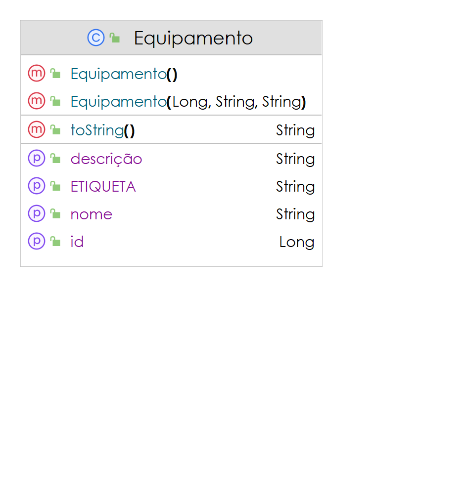
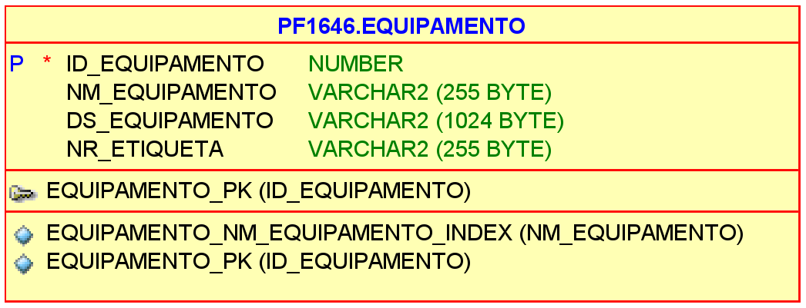

# EQUIPAMENTOS BENEZINHO 🤓👍🏾

[ SIMULADO ] Domain Driven Design aplicado em 29/09/2023.

|                | **Domain Driven Design** |
|------------------------------------------|--------------------------|
| **ALUNO:**                               | **TURMA:** 1TDSA         |
| **PROFESSOR:** Benefrancis do Nascimento | 29/09/2023                |
| **SIMULADO**                             | ****                     |

# Sumário

[Estudo de caso ](#_Estudo_de_caso)

[O que deverá ser feito? ](#_O_que_devera_ser_feito)

[Diagrama de Classes ](#_Diagrama_de_Classes)

[Diagrama de Entidade e Relacionamento ](#_DER)

[Como Entregar ](#_Entrega)

[Correção ](#_Correcao)

<a id="_Estudo_de_caso"></a>

# Estudo de caso

A diversas empresas da Holding adquirem anualmente milhares de equipamentos no Brasil e no exterior. Precisamos ter o cadastro dos equipamentos aos quais os funcionários da Holding estão demandando a compra.

Nasce dai a necessidade de desenvolver um sistema para solicitação de compra de equipamentos. Nossa equipe de analistas ainda não terminou o desenvolvimento do **Diagrama de Classes** e do **Diagrama de Entidade e Relacionamento**, porém já conseguiram adiantar que será necessário construir uma API RESTfull e adiantou as especificações de uma classe que está esposta no Diagrama de Classes abaixo. 

A sua missão é implementar código capaz de separar as responsabilidades das classes entre as camadas objetivando melhor legibilidade e manutenibilidade do código do programa utilizando as interfaces **Repository** e **Resource** que foram fornecidas; desenvolver a fábrica de conexões que será responsável pela conexão com o Sistema Gerenciador de Base de Dados Relacional ( SGBDR ) **Oracle** seguindo às orientações abaixo elencadas:


1. Criação da Fábrica de Conexão adotando o padrão **Singleton**. A conexão deverá utilizar o **Hikari** e ser criada com base nos parâmetros do arquivo **application.properties**


2. A criação da classe responsável pela persistência, alteração, recuperação e remoção dos dados no repositório. Esta classe deverá adotar o padrão **Singleton** e respeitar a interface **Repository** e o **Diagrama de Entidade e Relacionamento** (DER).


3. Como se trata de uma API RESTfull, você deverá implementar a classe **EquipamentoResource** respeitando a interface **Resource**. Os métodos desta classe deverão consumir e produzir **JSON** ( quando necessário ), deverá respeitar os verbos e Códigos de resposta **HTTP** vide [  https://developer.mozilla.org/pt-BR/docs/Web/HTTP/Status  ]. 


<a id="_O_que_devera_ser_feito"></a>

# O que deverá ser feito?

**Você deverá:**

**Fazer o fork do projeto do github.**:

https://github.com/Benefrancis/equipamento

Caso o github esteja indisponível, você deverá pegar o projeto no diretório compartilhado.

Alterar o arquivo contido em  **documentacao/equipe.txt** para incluir o seu nome e RM (esta atividade é individual).

**OBS:** Será com base no nome contidos neste aquivo que eu irei atribuir a nota.

1. **(Até 4,5 pontos)** A Classe **EquipamentoRepository**:

      1. **(0,5 Pontos)** implementar corretamente o padrão **Singleton**.

      2. **(0,5 Ponto)** implementar corretamente o método **findAll**.

      3. **(1 Ponto)** implementar corretamente o método **findById**.

      4. **(1,5 Ponto)** implementar corretamente o método **update**.

      5. **(1 Ponto)** implementar corretamente o método **delete**.


2. **(Até 3,5 pontos)** A Classe **EquipamentoResource**:

   1. **(0,5 Ponto)** implementar corretamente o método **findAll**.

   2. **(1 Ponto)** implementar corretamente o método **findById**.

   3. **(1,5 Ponto)** implementar corretamente o método **update**.

   4. **(0,5 Ponto)** implementar corretamente o método **delete**.


3. **(Até 2 pontos)** A Classe **ConnectionFactory**:

   1. **(0,5 Pontos)** implementar corretamente o padrão **Singleton**.

   2. **(0,5 Pontos)** implementar corretamente o método **getConnection**.

   3. **(1 Pontos)** implementar corretamente o método **getCredenciais**.


<a id="_Diagrama_de_Classes"></a>

# Diagrama de Classes de Entidade




<a id="_DER"></a>

# Diagrama de Entidade e Relacionamento



<a id="_Entrega"></a>

# Como Entregar

**A entrega deverá ser feita pelo TEAMS**, porém não se esqueça de fazer o **commit** e **push** do projeto no github.

<a id="_Correcao"></a>

# Correção da Prova

Nos próximos dias, a correção da prova será disponibilizada no github do professor (branch correcao):

Para acessar digite no prompt:

```shell
git clone https://github.com/Benefrancis/equipamento && cd equipamento && git checkout correcao
```

A avaliação é individual.

Boa avaliação.
